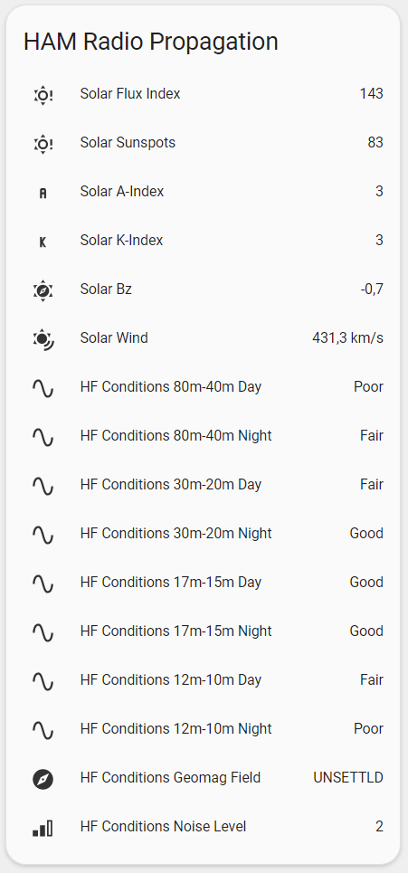

# HAM Radio Propagation for Home Assistant

[![GitHub Release][releases-shield]][releases]
[![License][license-shield]](LICENSE)

[![hacs][hacsbadge]][hacs]
[![Project Maintenance][maintenance-shield]][user_profile]
[![BuyMeCoffee][buymecoffeebadge]][buymecoffee]


Welcome to my repository Home Assistant - Custom Component for HAM Radio Propagation connected to the [hamqsl.com][hamqsl] API.

---

## Introduction

> The goal is to integrate the data from hamqsl.com APIs in a custom component in Home Assistant.
> This custom component is still in the development/testing phase. 
> Bugs are still being worked out and breaking changes are common.

## Installation

### Using [Home Assistant Community Store](https://hacs.xyz/) (recommended)

This integration can be added to HACS as a [custom repository](https://hacs.xyz/docs/faq/custom_repositories):

* URL: `https://github.com/emics/ham_radio_propagation`
* Category: `Integration`

Once downloaded and configured as per below information, you'll need to restart HomeAssistant to have the custom component and the sensors of ham_radio_propagation platform taken into consideration.

Then add the data to your `configuration.yaml` file as shown in the example:

```yaml
# Example configuration.yaml entry
sensor:
  - platform: ham_radio_propagation
```

## Configuration
This Integration don't require configuration.
Adding sensor in Lovelace, add an Entiy List and paste this code.

```yaml
type: entities
entities:
  - entity: sensor.ham_radio_propagation_solar_flux_index
  - entity: sensor.ham_radio_propagation_solar_sunspots
  - entity: sensor.ham_radio_propagation_solar_a_index
  - entity: sensor.ham_radio_propagation_solar_k_index
  - entity: sensor.ham_radio_propagation_solar_bz
  - entity: sensor.ham_radio_propagation_solar_wind
  - entity: sensor.ham_radio_propagation_solar_hf_80_40_day
  - entity: sensor.ham_radio_propagation_solar_hf_80_40_night
  - entity: sensor.ham_radio_propagation_solar_hf_30_20_day
  - entity: sensor.ham_radio_propagation_solar_hf_30_20_night
  - entity: sensor.ham_radio_propagation_solar_hf_17_15_day
  - entity: sensor.ham_radio_propagation_solar_hf_17_15_night
  - entity: sensor.ham_radio_propagation_solar_hf_12_10_day
  - entity: sensor.ham_radio_propagation_solar_hf_12_10_night
  - entity: sensor.ham_radio_propagation_solar_geomag_field
  - entity: sensor.ham_radio_propagation_solar_sig_noise_lvl
title: HAM Radio Propagation
```

This is the result:



## Contributions are welcome

---

## Trademark Legal Notices

All product names, trademarks and registered trademarks in the images in this repository, are property of their respective owners.
All images in this repository are used by the author for identification purposes only.
The use of these names, trademarks and brands appearing in these image files, do not imply endorsement.

<!--- hacs -->
[hacs]: https://github.com/custom-components/hacs
[hacsbadge]: https://img.shields.io/badge/HACS-Custom-orange.svg?style=for-the-badge
[hacs_faq_custom]: https://hacs.xyz/docs/faq/custom_repositories
[hacs_custom]: https://img.shields.io/badge/HACS-Custom-41BDF5.svg
[hacs_integration]: https://github.com/hacs/integration
[releases-shield]: https://img.shields.io/github/release/emics/ham_radio_propagation.svg?style=for-the-badge
[releases]: https://github.com/emics/ham_radio_propagation/releases
[user_profile]: https://github.com/emics
[license-shield]: https://img.shields.io/github/license/emics/ham_radio_propagation.svg?style=for-the-badge
[maintenance-shield]: https://img.shields.io/badge/maintainer-%40emics-blue.svg?style=for-the-badge
[entity-list]: https://github.com/emics/ham_radio_propagation/assets/entity_list.png

<!--- External Link -->
[hamqsl]: http://www.hamqsl.com/
[buymecoffee]: https://www.buymeacoffee.com/emics
[buymecoffeebadge]: https://img.shields.io/badge/buy%20me%20a%20coffee-donate-yellow.svg?style=for-the-badge
